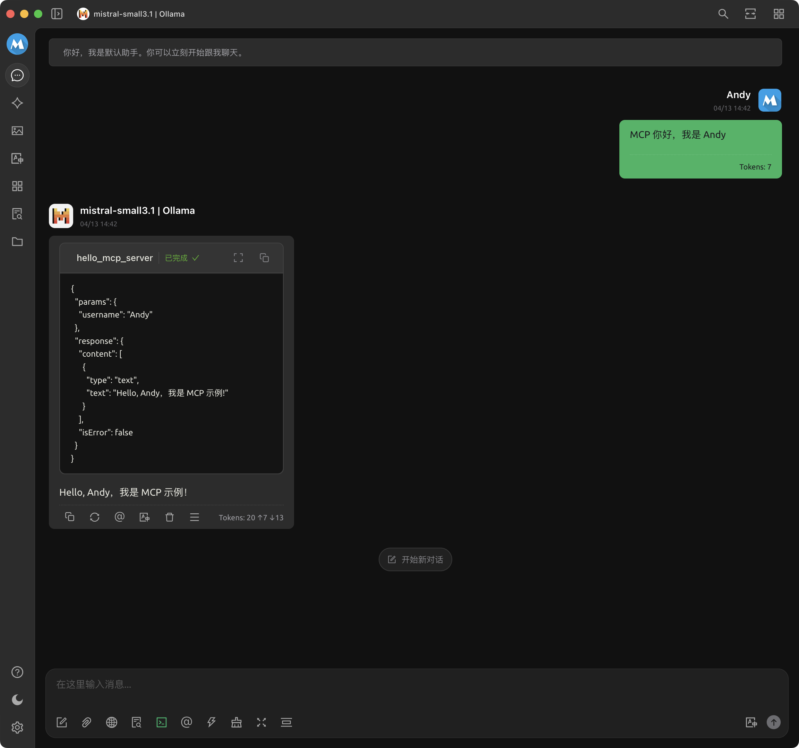

# MCP Server 示例：01_hello_mcp_server

## MCP Server 配置

```json
{
    "mcpServers": {
        "hello-mcp-server": {
            "isActive": true,
            "name": "hello-mcp-server",
            "type": "stdio",
            "description": "MCP Server示例：向 MCP 打招呼",
            "registryUrl": "",
            "command": "uv",
            "args": [
                "run",
                "--directory",
                "<mcp_playground 项目路径>/01_hello_mcp_server",
                "--with",
                "mcp",
                "mcp",
                "run",
                "hello_mcp_server.py"
            ]
        }
    }
}

```

## 效果演示

