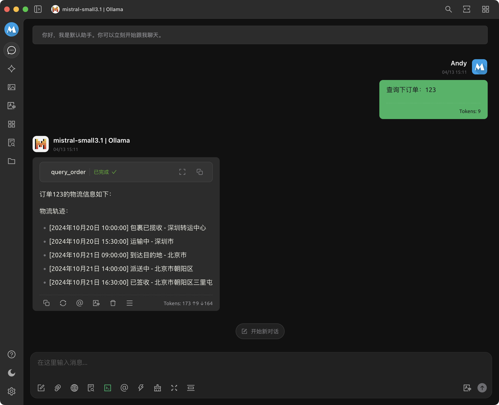

# MCP Server 示例：02_query_order

## MCP Server 配置

```json
{
    "mcpServers": {
        "query-order": {
            "name": "query-order",
            "type": "stdio",
            "description": "MCP 服务器示例：查询订单",
            "isActive": true,
            "registryUrl": "",
            "command": "uv",
            "args": [
                "run",
                "--directory",
                "<mcp_playground 项目路径>/02_query_order",
                "--with",
                "mcp",
                "mcp",
                "run",
                "query_order.py"
            ]
        }
    }
}
```

## 效果演示

