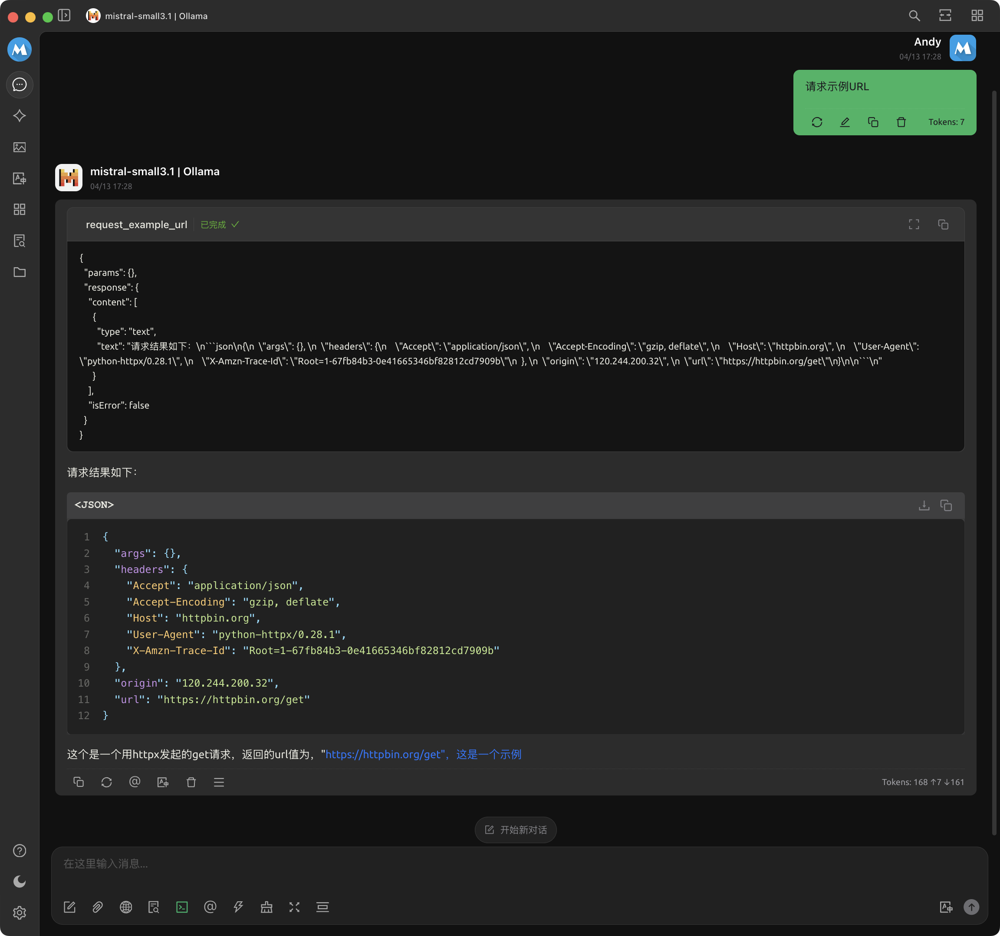

# MCP Server 示例：03_request_url

## MCP Server 配置

```json
{
  "mcpServers": {
    "request-example-url": {
      "name": "request-example-url",
      "type": "stdio",
      "description": "MCP 服务器示例：请求示例 URL。当用户要求请求示例URL时，调用此工具。",
      "isActive": true,
      "registryUrl": "",
      "command": "uv",
      "args": [
        "run",
        "--directory",
        "<mcp_playground 项目路径>/03_request_url",
        "--with",
        "mcp",
        "mcp",
        "run",
        "request_url.py"
      ]
    }
  }
}
```

## 效果演示

