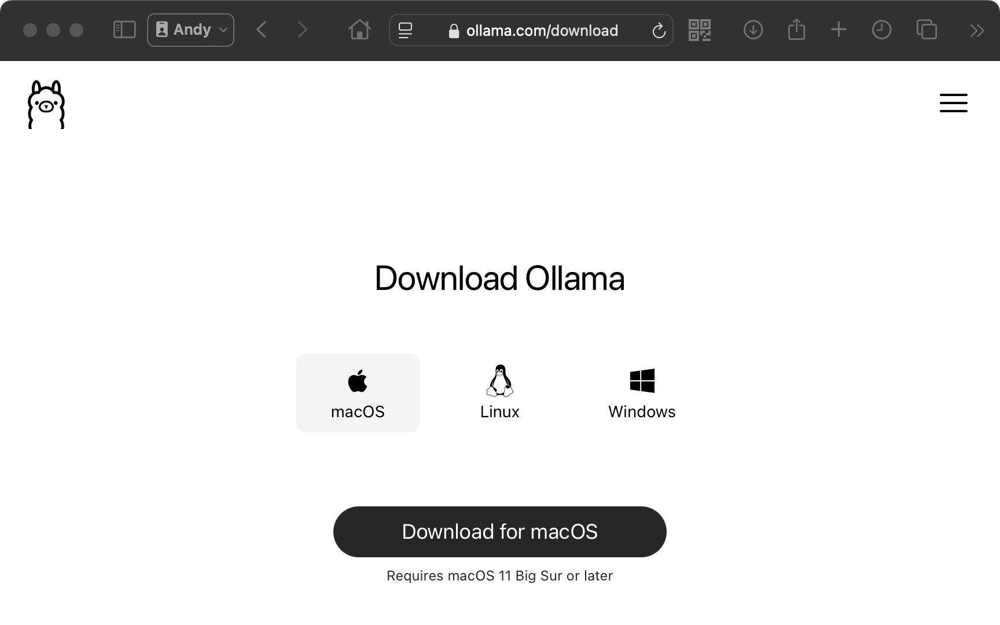
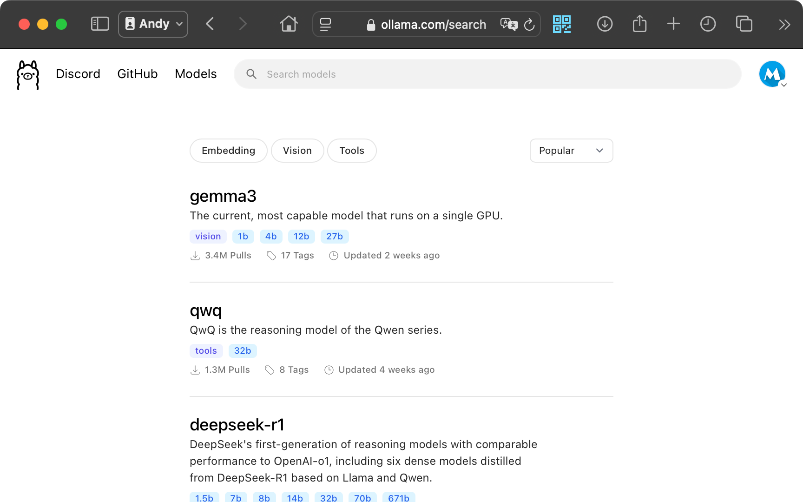
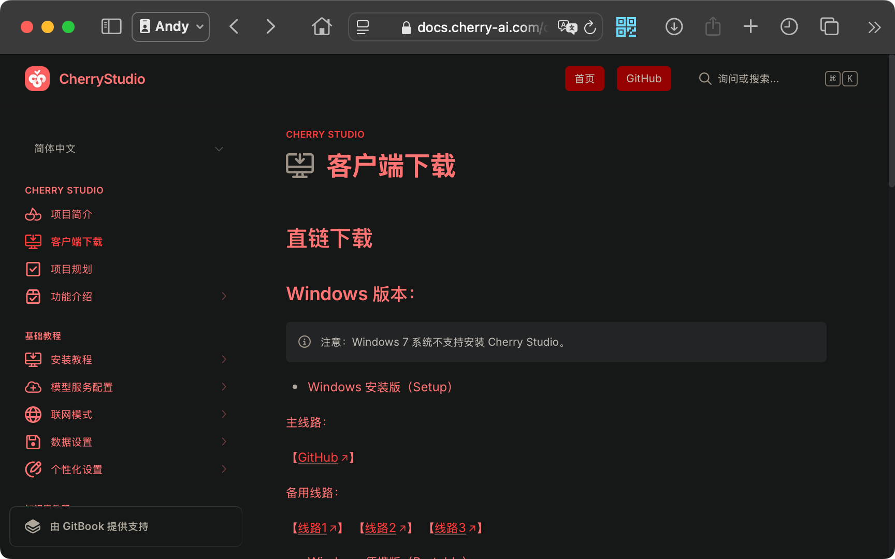
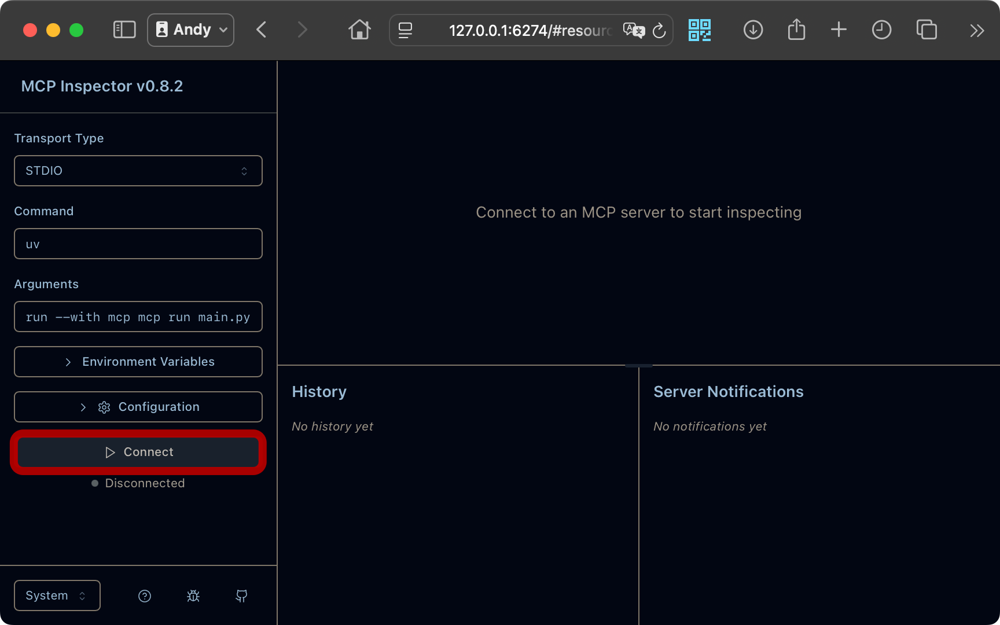
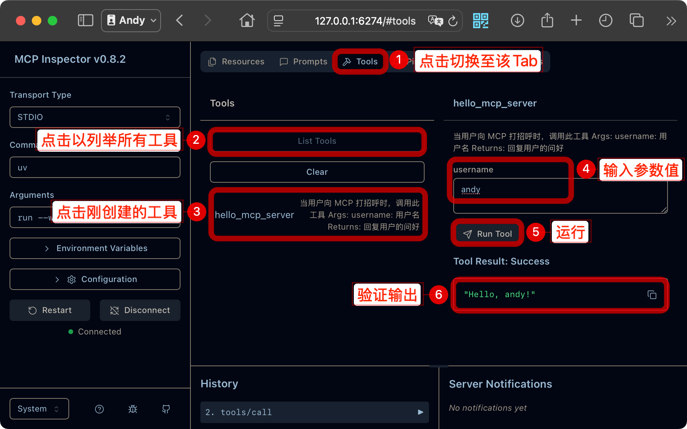
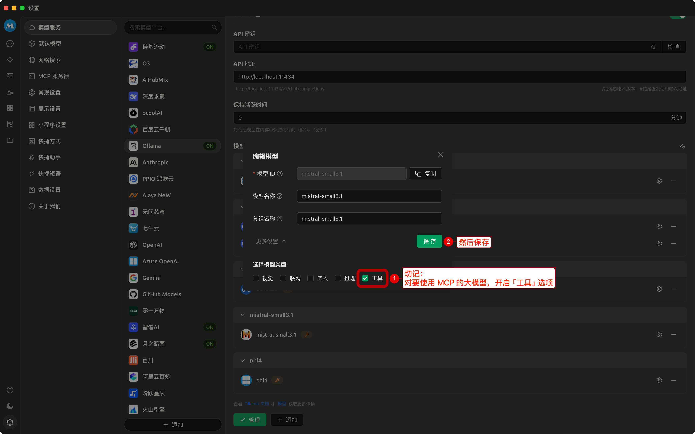
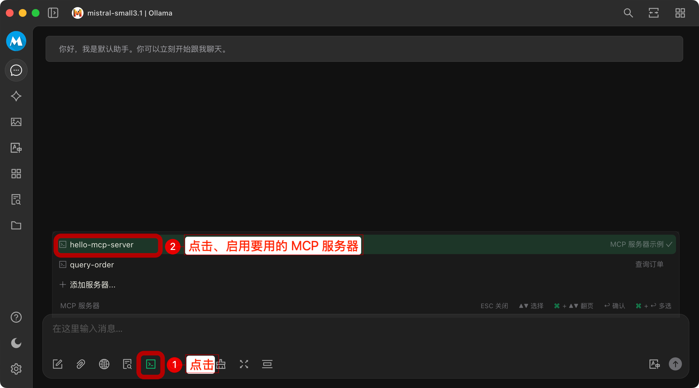
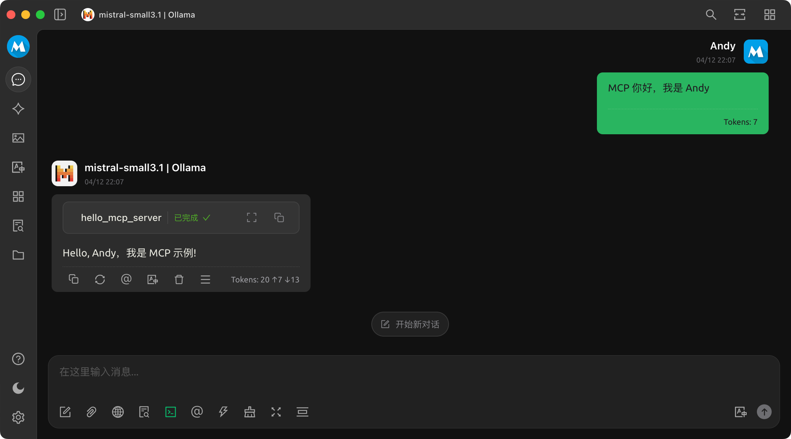

> 详见原文，以获得最新的内容：[【AI入门】MCP 初探 - 掘金](https://juejin.cn/post/7491949045130706998)

---


# 1、前言

大模型火了一阵子了，最近又火了一个技术 —— MCP

在看了一些介绍后，恰巧之前通过 Ollama 也部署了本地大模型，正好可以试试本地 MCP，兴许可以「以后 自己开发些 MCP，然后通过本地大模型调用」，这样就能摆脱 UI、Terminal 来执行特定的操作了~~

# 2、准备

## 2.1、安装  Ollama

访问 Ollama 官网： https://ollama.com/download ，下载需要的版本，并安装：


安装指定的大模型：


【PS】我目前在本地安装了以下几个大模型：
```shell
$ ollama list
NAME                       ID              SIZE      MODIFIED
mistral-small3.1:latest    b9aaf0c2586a    15 GB     12 minutes ago
phi4:latest                ac896e5b8b34    9.1 GB    7 weeks ago
deepseek-r1:14b            ea35dfe18182    9.0 GB    8 weeks ago
bge-m3:latest              790764642607    1.2 GB    8 weeks ago
deepseek-r1:32b            38056bbcbb2d    19 GB     8 weeks ago
llama3.2:latest            a80c4f17acd5    2.0 GB    8 weeks ago
```


## 2.2、安装 CherryStudio

这是一个本地大模型的客户端，以便配合 Ollama 来使用本地大模型

访问官网 https://docs.cherry-ai.com/cherry-studio/download ，下载需要的版本，并安装：


# 3、安装、开发 MCP 

> 以下内容，以通过 Python 开发为例进行介绍。

## 3.1、安装 UV

`uv` 是一个 MCP 推荐的 Python 包管理工具，可以参考其官网 进行安装： https://docs.astral.sh/uv/getting-started/installation/#installation-methods

我的安装方式&过程如下：
```shell
$ wget -qO- https://astral.sh/uv/install.sh | sh
downloading uv 0.6.14 aarch64-apple-darwin
no checksums to verify
installing to /Users/mengxinxin/.local/bin
  uv
  uvx
everything\'s installed!

To add $HOME/.local/bin to your PATH, either restart your shell or run:

    source $HOME/.local/bin/env (sh, bash, zsh)
    source $HOME/.local/bin/env.fish (fish)
WARNING: The following commands are shadowed by other commands in your PATH: uv uvx


$ uv version
uv 0.6.14 (a4cec56dc 2025-04-09)
```


## 3.2、创建&初始化一个 MCP项目

```shell
# 初始化项目
$ uv init hello_mcp_server

# 进入项目目录
$ cd hello_mcp_server

# 创建环境
$ uv venv

# 激活环境
$ source .venv/bin/activate

# 安装依赖
$ uv add "mcp[cli]"
```

## 3.3、开发&调试 MCP

示例代码如下：
```python
from mcp.server.fastmcp import FastMCP
from pydantic import Field


# Initialize FastMCP server
mcp = FastMCP("hello-mcp-server", log_level="ERROR")


# 注册工具的装饰器，可以很方便的把一个函数注册为工具
@mcp.tool()
async def hello_mcp_server(username: str = Field(description="用户名")) -> str:
    """当用户向 MCP 打招呼时，调用此工具

    Args:
        username: 用户名

    Returns:
        回复用户的问好
    """
    return f"Hello, {username}，我是 MCP 示例!"


def main():
    print("Hello from hello-mcp-server!")


if __name__ == "__main__":
    main()
```

执行如下名，可获得调试地址：
```
$ mcp dev hello_mcp_server.py
Starting MCP inspector...
⚙️ Proxy server listening on port 6277
🔍 MCP Inspector is up and running at http://127.0.0.1:6274 🚀
```

在浏览器中访问该调试地址： http://127.0.0.1:6274 ，并点击 Connect：


然后如图操作、验证工具：


# 4、接入 CherryStudio

## 4.1、添加 MCP 服务器


## 4.2、设置大模型



## 4.3、在对话中启用 MCP 服务器



## 4.4、完成，试一下吧~



以上，搞定，收工~ ✌🏻

